<h1 align="center">📝 To Do List App 📝</h1>

This is a simple to-do list application that helps you keep track of your tasks and monitor your daily progress on any project or task. It can also help you remember any pending tasks. With this application, you can easily create and manage your to-do lists set prioritize your work. Whether you’re working on a personal project or even you daily tasks, this application can help you stay organized and focused.

The to-do List App is live, please [Click Here](https://alakeldev.github.io/to-do-list-pp2/) to check It.

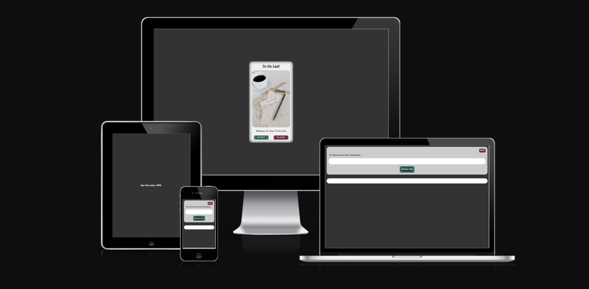

You can check the App on "Am I Responsive!" Website By [Clicking Here](https://ui.dev/amiresponsive?url=https://alakeldev.github.io/to-do-list-pp2/).

Also you can check it on "Responsive Design Checker" Website By [Clicking Here](https://responsivedesignchecker.com/checker.php?url=https%3A%2F%2Falakeldev.github.io%2Fto-do-list-pp2%2F&width=1400&height=700).

## Tabel of Contents
- [Tabel of Contents](#tabel-of-contents)
- [UX](#ux)
  - [Site/App Purpose](#siteapp-purpose)
  - [Site/App Goal](#siteapp-goal)
  - [Audience](#audience)
  - [Communication](#communication)
  - [Current User Goals](#current-user-goals)
  - [New User Goals](#new-user-goals)
- [Design](#design)
  - [Colour Scheme](#colour-scheme)
  - [Typography](#typography)
  - [Imagery](#imagery)
- [Features](#features)
  - [Existing Features](#existing-features)
    - [Start page](#start-page)
    - [Main App page](#main-app-page)
    - [See You Later page](#see-you-later-page)
    - [404 page](#404-page)
  - [Future Features](#future-features)
- [Testing](#testing)
  - [Manual Testing](#manual-testing)
  - [Validator Testing](#validator-testing)
  - [Unfixed Bugs](#unfixed-bugs)
- [Technologies Used](#technologies-used)
  - [Main Languages Used](#main-languages-used)
  - [Frameworks, Libraries \& Programs Used](#frameworks-libraries--programs-used)
- [Deployment](#deployment)
  - [How to deploy](#how-to-deploy)
  - [How to clone](#how-to-clone)
- [Credits](#credits)
  - [Media](#media)
  - [Code](#code)
  - [Acknowledgements](#acknowledgements)

## UX

### Site/App Purpose
To provide yourself with a list of your priorities in order to ensure that you don’t forget anything and are able to effectively plan out your tasks so that they are all accomplished in the correct time frame.

### Site/App Goal
To help you organize tasks and stay on top of your deadlines. It replaces pen-and-paper to-do lists and can be used from mobile/Tablet devices and many desktop devices. It helps you stay productive by organizing everything you need to do in one place.

### Audience
Anyone who wants to keep track of their tasks and stay organized. It can be used by students, professionals, and anyone who wants to be more productive and efficient with their time.

### Communication
Our application has a clear and simple design that allows you to add tasks and monitor your progress anytime. Even if you close the app, browser or even your device, you can get back to your added tasks and monitor your progress because of the local storage feature. The App structure is also well-organized and easy to navigate.

### Current User Goals
- To help the user stay organized and productive.
- To reduce user stress and anxiety by keeping track of tasks.
- To have a clear picture of what the user need to do.
- To feel more in control of the user workload and less overwhelmed.

### New User Goals
- To learn how to use the app effectively and efficiently.
- To find new ways to stay motivated and focused on their tasks.
- To discover new features and capabilities of the app that can help them be more productive.
- To customize the app to their specific needs and preferences.

## Design

### Colour Scheme
The color palette was created by [Coolors](https://coolors.co) with the idea of providing as much contrast as possible without feeling overwhelming. Most of the colors are primarily dark, simple, and calm across the site. However, the backgrounds (body element color) were generated in one main color (dark color “Jet”). Also, the texts have two main colors (black and white), but the title of the clear all button has a red color. Additionally, I’m using coloring shadows “inset” with Rose and Turquoise colors inside the buttons and coloring shadows “inset” with black color and anti-flash white as a background for the start app interface. The combination of the background color and shadow color does not overwhelm the user but gives a dark, simple, and stylish feeling. Also the main point of these colors that It does not hurt the eyes by working in a dark/night room.

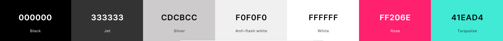

### Typography
"Lora" was selected for the all application pages as this font has simple, readable and clear decoration. also I make some words looking great by manipulating the space between letters.  ("sans-serif as alt font").

### Imagery
The start interface image was carefully chosen to evoke a sense of comfort and organization. It features a pen and a to-do list for the week, accompanied by a cup of coffee. This image is intended to inspire users to organize their tasks and approach them with a sense of calm and focus.

## Features

### Existing Features
#### Start page

We are providing the user with a simple design for a start page application. The start interface is simple with a dark background color that defines the soul of the app to make the user’s eyes more comfortable. Inside this page, users have a simple design with a header, image and simple text. They can choose between two options. The first one is to start the application by clicking on the start button that has the same background color as the body page but with an inset shadow (inner) that has turquoise color. The combination of these two colors gives good UX (also as a shortcut hand, users can push the Enter key on their keyboard directly to start the application). The other option is by clicking on the close button that also has the same background color of the body page but with an inner shadow that has rose color. This action will lead to closing the application if they change their mind.

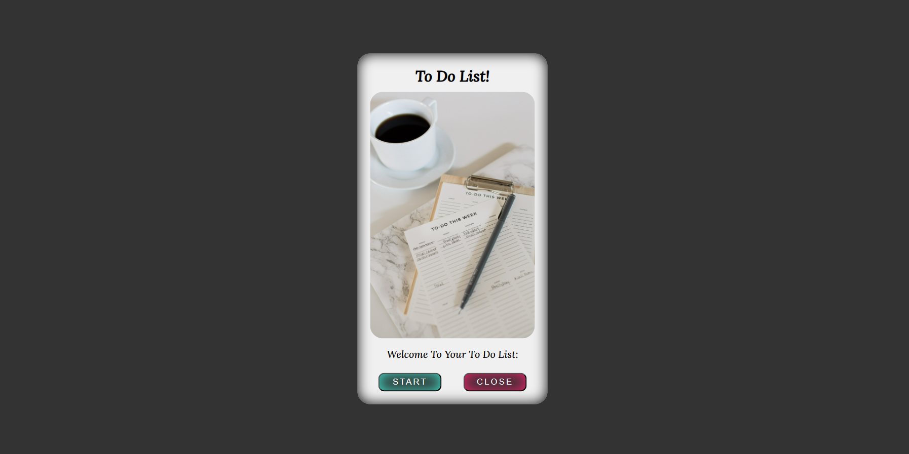

#### Main App page

On the main page of our to-do list application, users can add new tasks using the simple and intuitive new task adding process. The first section includes an exit button for users who want to leave the app, as well as simple text to guide users on what they should do. An empty field is provided for users to enter their tasks, and below the empty field is the ‘Add New Task’ button. Users can enter their task and press the button to add it to the list.
The other section on the main page of our to-do list application is the list of tasks. Users can see all the tasks they have added and review them as needed. Each task can be deleted from the list after it has been completed. Additionally, users can clear the entire list and start a new to-do list with no previous tasks displayed.

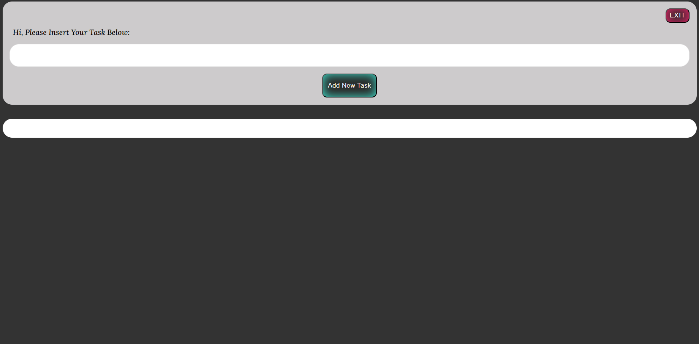

#### See You Later page

When users press the exit button on the main page of our to-do list application, they are taken to a ‘See You Later’ page. This page has a simple design with a turquoise smiley face and simple text that enhances the user experience and encourages users to come back later and use the app with ease.

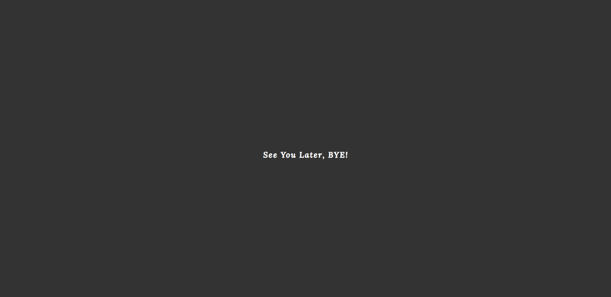

#### 404 page

This page is designed to be simple and straightforward, displaying only the application title and error type/info. Additionally, it includes a small text with a link that guides users back to the start page of the application.

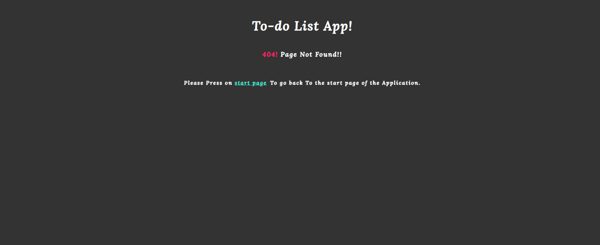

### Future Features
- A smart suggestions using machine learning algorithms to suggest tasks based on the user’s previous tasks and habits.
- A voice commands by adding voice commands to your app so that users can add tasks and complete them without having to type.
- An analytics features that allow users to track their productivity and see how much time they spend on different tasks.
- An Email notifications by sending Emails to remind the user about the pending tasks.

## Testing
### Manual Testing
I sent the live link to multiple people for feedback on functionality and design. I also tested the app repeatedly by myself in search of errors and improvements.

| Feature | Expected outcome - Process details | Does it work? |
| :-------------: | :-------------: | :-----: |
|Start page "loading successfully"| All page elements with their css style loaded as expected without issues. | Yes |
| Start Button "Auto Focus"| After all elements of start page loaded, it will be auto focus on start button. Also the user can access the App by hit the Enter button on keyboard.   | Yes   |
| Exit Button "Close App"  | IF the user Clicked on close button so the App window will be closed    | Yes  |
| Start Button "Go to Main App Page" | When the user clicked start button (Hit Enter), so it will open the main App page in the same window  | Yes |
| Main App Page "Loading Successfully" |  All page Elements with their css style loaded as expected without issues  |  Yes  |
| Empty Field "Auto Focus" | After All elements of main app page loaded, it will be auto focus on the input field (New Task Field), so the user can Write direct the Task  |  Yes |
| Alert Msg "Empty Field scenario"      |  When User clicked on add new task button without fill the empty field so it will appear an alert msg that show the exact reason of alert   |  Yes   |
| Alert Msg "Enter Task with More than 70 Characters"| when the user Enter the task but the task Characters reached to more than 70 characters then the user hit the add new task button so it will appear an alert msg showing the exact reason and after that it will clear the task field also auto focus on it again |  Yes   |
| Add new Task Button "Enter Key Button"|  When the user enter his task and his task is not empty field, equal or below 70 Characters can easy hit Enter button so it will add the new task smoothly to the list  |  Yes   |
| Task Added Successful "Auto Focus" |  After Successful added task so it will be focus again on the empty field   |   Yes  | 
| Showing the task inside the page |  After successful task added it will be showed on the page   |  Yes   | 
| Delete Task Button "Showed" |   Each added task it will showed on the page so it will appear its delete button so the user can attract with each task and deleted when ever he wants (if the task added by fault/ or after the task is done).   |   Yes  | 
| Task Added successful to "Local Storage"|  After Showed the task on the page it will be also added s to the local storage successfully |  Yes| 
| Delete Task Button "Delete"  |  when the user hit the delete button so its task will be deleted from the page succesfully   | Yes  | 
| Delete Task Button "LS Delete"  |  after succesful deleted the task from the page it will be direct deleted from Local Storage too   | Yes  | 
| Clear All Button "Appear" |  if the tasks list reached to two tasks or more so the clear all button will be appear on the page  |  Yes  | 
| clear All Button "Disappear" |   if the tasks list has only one task so the clear all button will be disapear from the page  |  Yes  | 
| Clear All Button "All Tasks List Deleted from(Page,LS,Array)" & "Auto Focus" |  when the user wants to clear the full tasks list and start from zero so the clear all button is the best way to do that, and also after finished it will be auto focus on new task input field |  Yes   | 
| Exit Button "Go to See you later page" | When the user want to exit the tasks list, he can easy hit the exit button so it takes to another page the show good interact to user with a smile face to come back again later |  Yes  | 
| Local Storage Feature    |   when the user close the App, browser or even trun the computer off so the tasks list will be there and can see it and add new tasks on it or even delete the old tasks from it without any issue.   |  Yes   | 
| See you later Page "loading successfully" |   All page elements with their css style loaded as expected without issues.  |  Yes   | 
| 404 page "loading successfully"| All page elements with their css style loaded as expected without issues.             | Yes    | 
| 404 Page "Start Page Link"    |   Inside the 404 page has a start page link so the user can go direct to start page app ease |  Yes |

### Validator Testing
- HTML (By using [W3C validator](https://validator.w3.org/))
  -  Result for index.html

     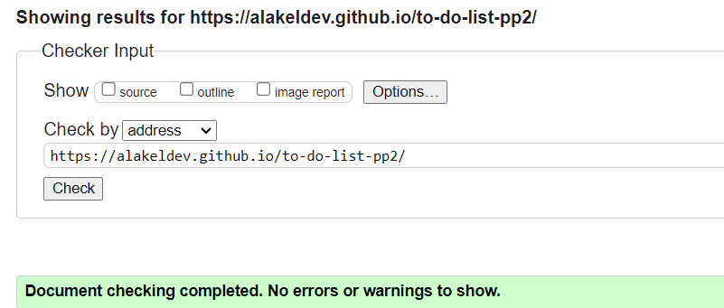
  -  Result for todolistpage.html

     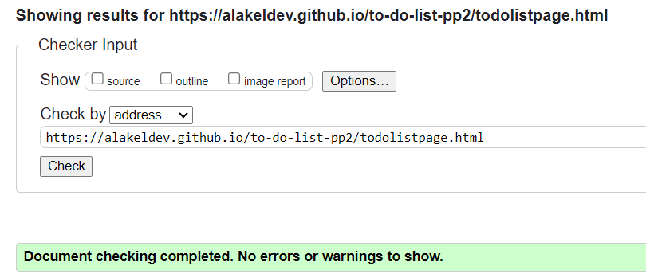
  -  Result for seeyoulater.html

     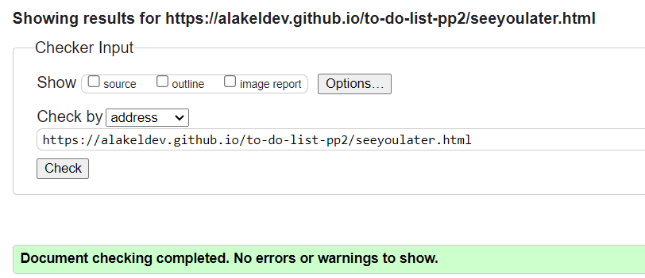

- CSS (By using [Jigsaw validator](https://jigsaw.w3.org/css-validator/))
  - Result for style.css

     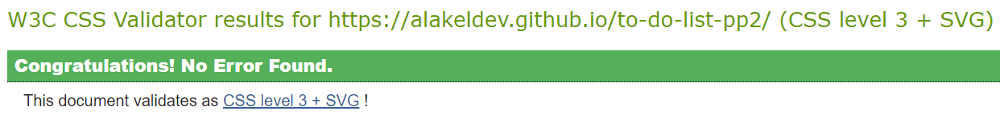

- JavaScript (By using [jshint](https://jshint.com/))

  - Result for start.js

    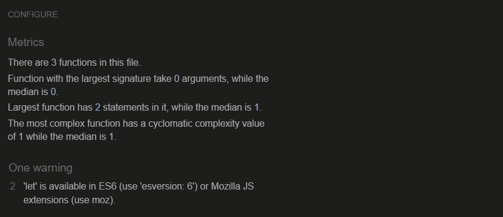
  - Result for main.js

    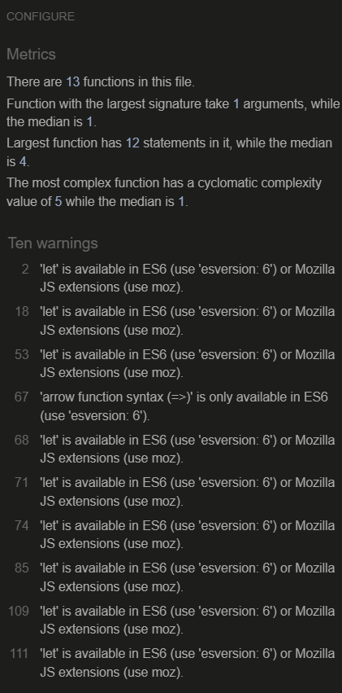
  - Result for end.js

    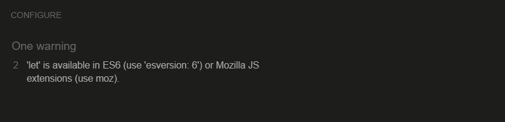

- Lighthouse Testing (By using the Lighthouse feature of Google Chrome's Developer Tools)
  - Result for index.html

     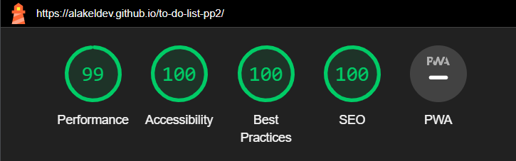
  - Result for todolistpage.html

     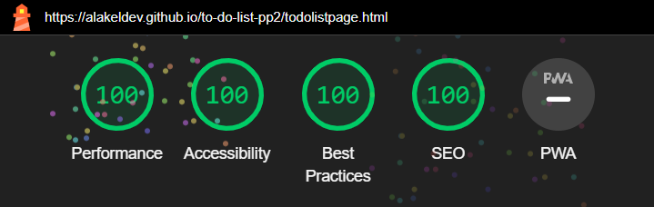
  - Result for seeyoulater.html

     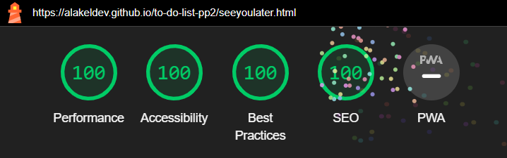

- Accessibilty (By using [WAVE](https://wave.webaim.org/))
  - There are No errors or contrast errors were returned, there are only two alerts displayed in all App pages as per image below:

    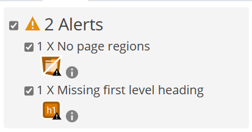

### Unfixed Bugs
- First Unfixed Bug: I am experiencing in all App pages an error on Chrome & MS-edge browsers console that I cannot resolve. I have tried adding special meta data on each header of HTML app pages and allowing all the cookies on Google Chrome but none of these solutions worked. The error does not occur at all when I use Firefox.

    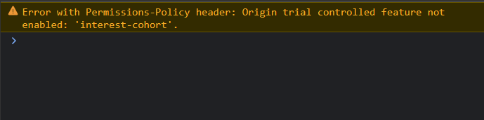

- Second Unfixed Bug: I am experiencing an error related to Canvas 2D in all app pages on Chrome and MS-Edge browsers console. The error is showing inside the process of Lighthouse and disappears after that.

    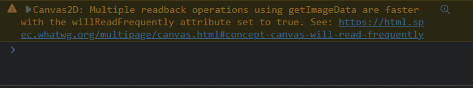

## Technologies Used
### Main Languages Used
- HTML5
- CSS3
- JavaScript

### Frameworks, Libraries & Programs Used
- Google Fonts - for the font families: "Lora" main font. San-serif was used as an alternative font.
- Coolors - to explore different colour schemes that best matched with simple and dark to do list App.
- VS-Code - to creat the html files, CSS styling sheet file and JS files before pushing the project to Github.
- GitHub - to store my repository and deployed live link for submission.
- Balsamiq-wireframes - was used to imagine the basic structure of the app without any styling.
- (Am I Responsive?) & (ResponsiveDesignChecker) - to ensure the project-App is looked good across all devices.
- favicon.io - to change the png format to favicon format.
- Google Chrome / MS-Edge / Firefox - "Developer Tools, Console, Local Storage" to Monitor my code and check the errors along the way.

## Deployment
### How to deploy
The site was deployed to GitHub pages. The steps to deploy are as follows:
- In the GitHub repository, navigate to the Settings tab.
- From the source section drop-down menu, select the main Branch.
- Once the main branch has been selected, the page will be automatically refreshed with a detailed ribbon display to indicate the successful deployment.
- The live link can be found Here [to-do List App](https://alakeldev.github.io/to-do-list-pp2/) .

 ### How to clone
- Go to the following repository on GitHub: https://github.com/alakeldev/to-do-list-pp2 .
- At the top right of the screen, click the 'Code' button, and then click 'HTTPs'.
- Copy the link in this field.
- Open VS-code, creat new project folder, open the terminal.
- On the terminal type "git clone", then paste the copied url and press 'Enter'.
- The clone process should now begin.

## Credits

### Media
The image for the start interface application was sourced from ["pinterest-website"](https://www.pinterest.com/pin/151715081184288287/) .

### Code

- HTML & CSS: In addition to my knowledge, previous experience, I have used the following websites as references:
  - [W3schools HTML - CSS](https://www.w3schools.com/html/) .
  - [HTML - cheatsheet](https://htmlcheatsheet.com/) .
  - [CSS - cheatsheet](https://htmlcheatsheet.com/css/) .

- Javascript: After completing the CI Material and [‘Love Maths’](https://alakeldev.github.io/love-maths-game/) walk-through project, I consulted the following websites as references:
  - [MDN Web Docs - JS](https://developer.mozilla.org/en-US/docs/Web/JavaScript/Reference) .
  - [W3schools - JS](https://www.w3schools.com/js/js_intro.asp) .
  - [DevDocs: API Documentation Browser - JS reference](https://devdocs.io/javascript/) .
  - [JS - cheatsheet](https://htmlcheatsheet.com/js/) .

- Canvas: I have gained a comprehensive understanding of the Canvas element and its drawing capabilities through JavaScript, including the ability to create charts and add small text within them. The following websites were instrumental in my journey:
  - [MDN Web Docs - Canvas](https://developer.mozilla.org/en-US/docs/Web/API/Canvas_API) .
  - [Kirupa - Canvas](https://www.kirupa.com/canvas/index.htm) .
  - [Chartjs - Canvas](https://www.chartjs.org/docs/latest/charts/bar.html) .

- Local Storage & JSON: I have used the following websites as my primary sources to gain an understanding of (local storage & JavaScript Object Notation'JSON')  and how to use it in my project:

  - [MDN Web Docs - LS](https://developer.mozilla.org/en-US/docs/Web/API/Window/localStorage) .
  - [logRocket - LS](https://blog.logrocket.com/localstorage-javascript-complete-guide/) .
  - [W3schools - LS](https://www.w3schools.com/jsref/prop_win_localstorage.asp) .
  - [The Modern JavaScript Tutorial - LS](https://javascript.info/localstorage) .
  - [MDN Web Docs - JSON(stringify(), parse())](https://developer.mozilla.org/en-US/docs/Web/JavaScript/Reference/Global_Objects/JSON/stringify) .
  - [Digital Ocean - JSON(stringify(), parse())](https://www.digitalocean.com/community/tutorials/js-json-parse-stringify) .
  - [W3schools - JSON(stringify(), parse())](https://www.w3schools.com/js/js_json_stringify.asp) .

- Youtube Videos: I watched the video/tutorial below for a simple to-do list app at the beginning of my project to gain an idea only:
  - [Youtube - to-do list tutorial](https://www.youtube.com/watch?v=-pRg_daFjfk&t=117s) .

- My Summarizes:  Throughout my JS study journey, I created a summary for JavaScript (Vanilla and DOM) and another one for Canvas "2D". This makes it easy for me to quickly review any information I need. If I cannot find what I am looking for in my summary, I will search for it on Google.
Currently, my summaries are a little bit messy, but I plan to sort it out once I finish studying BOM and OOP in JavaScript. I will then add it to my JS summary. You can take a look on my Summarizes through the links below:
  - [JavaScript](https://github.com/alakeldev/vanilla-dom-bom-oop-javascript-summarize-with-examples/blob/main/assets/js/script.js) .
  - [Canvas 2D](https://github.com/alakeldev/canvas-2d-summarize-with-examples/blob/main/assets/js/script.js) .

- Stack overflow: I used [Stack overflow](https://stackoverflow.com/) to try and fix the unfixed bugs, but the errors are still appearing as I mentioned in the unfixed bugs section.

### Acknowledgements

- I want to say thank you to my mentor Martina, who consistently gave me good advices, feedback and helped me to keep the project within the prospective guidelines.

- I would like to thank the assessor for their comments related to my previous project (PP1). They helped me avoid making the same mistakes again, except for one: my Github commit messages are still too long. I apologize for this because when I received these valuable comments, I was almost finished with (PP2). However, I will try my best throughout (PP3) to make my commit messages within 50 characters.