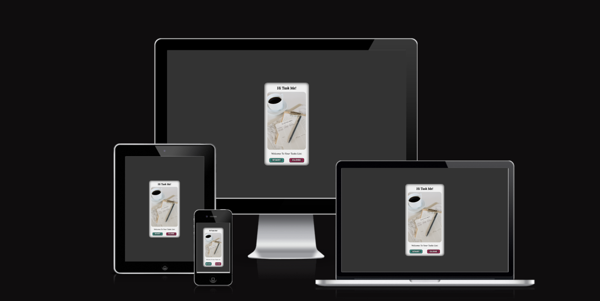
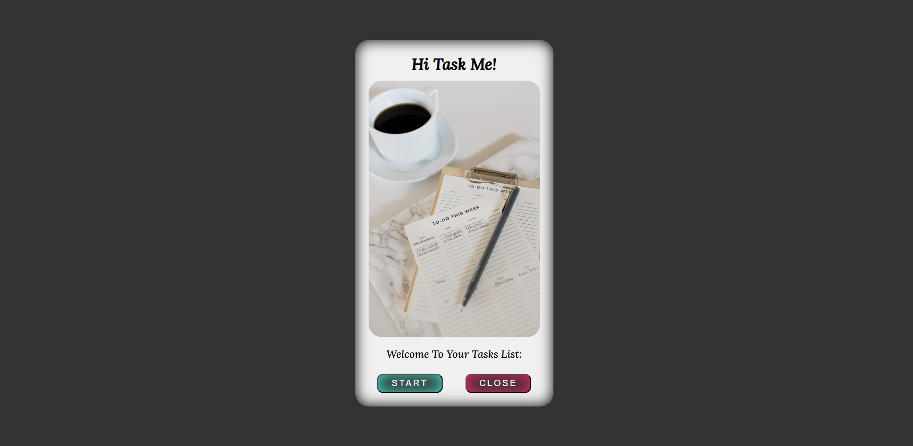

<h1 align="center">📝 To Do List App 📝</h1>

This is a simple to-do list application that helps you keep track of your tasks and monitor your daily progress on any project or task. It can also help you remember any pending tasks. With this application, you can easily create and manage your to-do lists set prioritize your work. Whether you’re working on a personal project or even you daily tasks, this application can help you stay organized and focused.

The to-do List App is live, please [Click Here](https://alakeldev.github.io/to-do-list-pp2/) to check It.

You can check the App on "Am I Responsive!" Website By [Clicking Here](https://ui.dev/amiresponsive?url=https://alakeldev.github.io/to-do-list-pp2/).

Also you can check it on "Responsive Design Checker" Website too By [Clicking Here](https://responsivedesignchecker.com/checker.php?url=https%3A%2F%2Falakeldev.github.io%2Fto-do-list-pp2%2F&width=1400&height=700).

## Tabel of Contents
- [Tabel of Contents](#tabel-of-contents)
- [UX](#ux)
  - [Site/App Purpose](#siteapp-purpose)
  - [Site/App Goal](#siteapp-goal)
  - [Audience](#audience)
  - [Communication](#communication)
  - [Current User Goals](#current-user-goals)
  - [New User Goals](#new-user-goals)
- [Design](#design)
  - [Colour Scheme](#colour-scheme)
  - [Typography](#typography)
  - [Imagery](#imagery)
- [Features](#features)
  - [Existing Features](#existing-features)
    - [Start page](#start-page)
    - [Main App page](#main-app-page)
    - [See You Later page](#see-you-later-page)
    - [404 page](#404-page)
  - [Future Features](#future-features)
- [Testing](#testing)
  - [Validator Testing](#validator-testing)
  - [Unfixed Bugs](#unfixed-bugs)
- [Technologies Used](#technologies-used)
  - [Main Languages Used](#main-languages-used)
  - [Frameworks, Libraries \& Programs Used](#frameworks-libraries--programs-used)
- [Deployment](#deployment)
  - [How to deploy](#how-to-deploy)
  - [How to clone](#how-to-clone)
- [Credits](#credits)
  - [Content](#content)
  - [Acknowledgements](#acknowledgements)

## UX

### Site/App Purpose
To provide yourself with a list of your priorities in order to ensure that you don’t forget anything and are able to effectively plan out your tasks so that they are all accomplished in the correct time frame.

### Site/App Goal
To help you organize tasks and stay on top of your deadlines. It replaces pen-and-paper to-do lists and can be used from mobile/Tablet devices and many desktop devices. It helps you stay productive by organizing everything you need to do in one place.

### Audience
Anyone who wants to keep track of their tasks and stay organized. It can be used by students, professionals, and anyone who wants to be more productive and efficient with their time.

### Communication
Through the application, with a clear and simple design, you can add tasks and monitor your progress anytime. Even if you close the app, browser or even your device, you can get back to your added tasks and monitor your progress because of the local storage feature. The website structure is also good and clear.

### Current User Goals
- To help the user stay organized and productive.
- To reduce user stress and anxiety by keeping track of tasks.
- To have a clear picture of what the user need to do.
- To feel more in control of the user workload and less overwhelmed.

### New User Goals
- To learn how to use the app effectively and efficiently.
- To find new ways to stay motivated and focused on their tasks.
- To discover new features and capabilities of the app that can help them be more productive.
- To customize the app to their specific needs and preferences.

## Design

### Colour Scheme
The color palette was created by [Coolors](https://coolors.co) with the idea of providing as much contrast as possible without feeling overwhelming. Most of the colors are primarily dark, simple, and calm across the site. However, the backgrounds (body element color) were generated in one main color (dark color “Jet”). Also, the texts have two main colors (black and white), but the title of the clear all button has a red color. Additionally, I’m using coloring shadows “inset” with Rose and Turquoise colors inside the buttons and coloring shadows “inset” with black color and anti-flash white as a background for the start app interface. The combination of the background color and shadow color does not overwhelm the user but gives a dark, simple, and stylish feeling. Also the main point of these colors that It does not hurt the eyes by working in a dark/night room.

### Typography
"Lora" was selected for the all application pages as this font has simple, readable and clear decoration. also I make some words looking great by manipulating the space between letters.  ("sans-serif as alt font").

### Imagery
The showing image on the start interface application was sourced from ["pinterest-website"](https://www.pinterest.com/pin/151715081184288287/).

## Features

### Existing Features
#### Start page

We are providing the user with a simple design for a start page application. The start interface is simple with a dark background color that defines the soul of the app to make the user’s eyes more comfortable. Inside this page, users have a simple design with a header, image and simple text. They can choose between two options. The first one is to start the application by clicking on the start button that has the same background color as the body page but with an inset shadow (inner) that has turquoise color. The combination of these two colors gives good UX (also as a shortcut hand, users can push the Enter key on their keyboard directly to start the application). The other option is by clicking on the close button that also has the same background color of the body page but with an inner shadow that has rose color. This action will lead to closing the application if they change their mind.

#### Main App page

On the main page of our to-do list application, users can add new tasks using the simple and intuitive new task adding process. The first section includes an exit button for users who want to leave the app, as well as simple text to guide users on what they should do. An empty field is provided for users to enter their tasks, and below the empty field is the ‘Add New Task’ button. Users can enter their task and press the button to add it to the list.
The other section on the main page of our to-do list application is the list of tasks. Users can see all the tasks they have added and review them as needed. Each task can be deleted from the list after it has been completed. Additionally, users can clear the entire list and start a new to-do list with no previous tasks displayed.

#### See You Later page

When users press the exit button on the main page of our to-do list application, they are taken to a ‘See You Later’ page. This page has a simple design with a turquoise smiley face and simple text that enhances the user experience and encourages users to come back later and use the app with ease.

#### 404 page

This page is designed to be simple and straightforward, displaying only the application title and error description. Additionally, it includes a small text with a link that guides users back to the start page of the application.

### Future Features
- A smart suggestions using machine learning algorithms to suggest tasks based on the user’s previous tasks and habits.
- A voice commands by adding voice commands to your app so that users can add tasks and complete them without having to type.
- An analytics features that allow users to track their productivity and see how much time they spend on different tasks.
- An Email notifications by sending Emails to remind the user about the pending tasks.

## Testing

### Validator Testing
- HTML (By using [W3C validator](https://validator.w3.org/))
  -  Result for index.html

     
  -  Result for todolistpage.html

     
  -  Result for seeyoulater.html

     

- CSS (By using [Jigsaw validator](https://jigsaw.w3.org/css-validator/))
  - Result for style.css

     

- JavaScript (By using [jshint](https://jshint.com/))

  - Result for start.js

    
  - Result for main.js

    
  - Result for end.js

    

- Lighthouse Testing (By using the Lighthouse feature of Google Chrome's Developer Tools)
  - Result for index.html

     
  - Result for todolistpage.html

     
  - Result for seeyoulater.html

     

- Accessibilty (By using [WAVE](https://wave.webaim.org/))
  - The image below shows that there are only two alerts displayed in all app pages:

    

### Unfixed Bugs

## Technologies Used
### Main Languages Used
- HTML5 & Canvas Element
- CSS3
- JavaScript

### Frameworks, Libraries & Programs Used
- Google Fonts - for the font families: "Lora" main font. San-serif was used as an alternative font.
- Coolors - to explore different colour schemes that best matched with simple and dark to do list App.
- VS-Code - to creat the html files, CSS styling sheet file and JS files before pushing the project to Github.
- GitHub - to store my repository and deployed live link for submission.
- Balsamiq-wireframes - was used to imagine the basic structure of the app without any styling.
- (Am I Responsive?) & (ResponsiveDesignChecker) - to ensure the project-App is looked good across all devices.
- favicon.io - to change the png format to favicon format.
- Google Chrome - "Developer Tools, Console, Local Storage" to Monitor my code and check the errors along the way.

## Deployment
### How to deploy
- The site was deployed to GitHub pages. The steps to deploy are as follows:
- In the GitHub repository, navigate to the Settings tab
- From the source section drop-down menu, select the main Branch
- Once the main branch has been selected, the page will be automatically refreshed with a detailed ribbon display to indicate the successful deployment.
- The live link can be found Here [to-do List](https://alakeldev.github.io/to-do-list-pp2/)

 ### How to clone
- Go to the following repository on GitHub: https://github.com/alakeldev/to-do-list-pp2
- At the top right of the screen, click the 'Code' button, and then click 'HTTPs'
- Copy the link in this field
- Open VS-code, creat new project folder, open the terminal
- On the terminal type "git clone", then paste the copied url and press 'Enter'
- The clone process should now begin

## Credits

### Content

### Acknowledgements

- I want to say thank you to my mentor Martina, who consistently gave me good advices, feedback and helped me to keep the project within the prospective guidelines.

- I would like to thank the assessor for their comments related to my previous project (PP1). They helped me avoid making the same mistakes again, except for one: my Github commit messages are still too long. I apologize for this because when I received these valuable comments, I was almost finished with (PP2). However, I will try my best throughout (PP3) to make my commit messages within 50 characters.