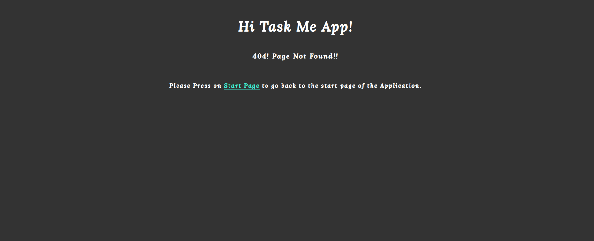
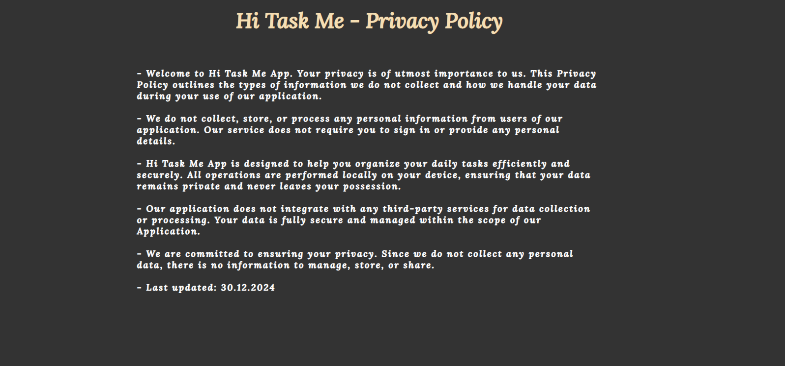

<h1 align="center">📝 Hi Task Me App 📝</h1>

This is a simple Tasks list application that helps you keep track of your tasks and monitor your daily progress on any project or task. It can also help you remember any pending tasks. With this application, you can easily create and manage your tasks lists and prioritize your work. Whether you’re working on a personal project or even your daily tasks, this application can help you stay organized and focused.

The Hi Task Me App is live, please [Click Here](https://alakeldev.github.io/hi-task-me-app/) to check It.

You can check the App on "Am I Responsive!" Website By [Clicking Here](https://ui.dev/amiresponsive?url=https://alakeldev.github.io/hi-task-me-app/).

## Tabel of Contents
- [Tabel of Contents](#tabel-of-contents)
- [UX](#ux)
  - [Site/App Purpose](#siteapp-purpose)
  - [Site/App Goal](#siteapp-goal)
  - [Audience](#audience)
  - [Communication](#communication)
  - [Current User Goals](#current-user-goals)
  - [New User Goals](#new-user-goals)
- [Design](#design)
  - [Colour Scheme](#colour-scheme)
  - [Typography](#typography)
  - [Imagery](#imagery)
- [Features](#features)
  - [Existing Features](#existing-features)
    - [Start page](#start-page)
    - [Main App page](#main-app-page)
    - [See You Later page](#see-you-later-page)
    - [404 page](#404-page)
    - [Privacy Policy page](#privacy-policy-page)
  - [Future Features](#future-features)
- [Testing](#testing)
  - [Manual Testing](#manual-testing)
  - [Validator Testing](#validator-testing)
  - [Unfixed Bugs](#unfixed-bugs)
- [Technologies Used](#technologies-used)
  - [Main Languages Used](#main-languages-used)
  - [Frameworks, Libraries \& Programs Used](#frameworks-libraries--programs-used)
- [Deployment](#deployment)
  - [How to deploy](#how-to-deploy)
  - [How to clone](#how-to-clone)
- [Credits](#credits)
  - [Media](#media)

## UX

### Site/App Purpose
Our application provides you with a comprehensive list of priorities and tasks to ensure that you don’t forget anything and can effectively plan out your tasks to accomplish them within the correct time frame.

### Site/App Goal
Our application is designed to help you stay organized and on top of your deadlines. It replaces traditional pen-and-paper to-do lists and can be used on mobile, tablet, and desktop devices. Our application is designed to help you stay productive by organizing everything you need to do in one place.

### Audience
Our application is designed for anyone who wants to stay organized and on top of their tasks. It can be used by students, professionals, and anyone who wants to be more productive and efficient with their time.

### Communication
Our application features a clear and simple design that allows you to add tasks and monitor your progress anytime. Even if you close the app, browser, or your device, you can easily get back to your added tasks and monitor your progress thanks to the local storage feature. The application structure is well-organized and easy to navigate, making it simple for you to manage your tasks and stay focused on your goals.

### Current User Goals
- To help the user stay organized and productive.
- To reduce user stress and anxiety by keeping track of tasks.
- To have a clear picture of what the user need to do.
- To feel more in control of the user workload and less overwhelmed.

### New User Goals
- To learn how to use the app effectively and efficiently.
- To find new ways to stay motivated and focused on their tasks.
- To discover new features and capabilities of the app that can help them be more productive.
- To customize the app to their specific needs and preferences.

## Design

### Colour Scheme
The color palette was created by [Coolors](https://coolors.co) with the idea of providing as much contrast as possible without feeling overwhelming. Most of the colors are primarily dark, simple, and calm across the site. The backgrounds (body element color) were generated in one main color (dark color “Jet”), while the texts have two main colors (black and white). The title of the clear all button has a red color. Additionally, coloring shadows “inset” with Rose and Turquoise colors were used inside the buttons, while coloring shadows “inset” with black color and anti-flash white were used as a background for the start app interface. The combination of the background color and shadow color does not overwhelm the user but gives a dark, simple, and stylish feeling. The main point of these colors is that they do not hurt the eyes when working in a dark/night room.

### Typography
The font “Lora” was selected for all application pages due to its simple, readable, and clear decoration. Additionally, some words were made to look great by manipulating the space between letters. The font “sans-serif” was used as an alternative font.

### Imagery
The image on the start interface was carefully selected to evoke a sense of comfort and organization. It features with a pen and to-do list for the week, accompanied by a cup of coffee. The image is intended to inspire users to organize their tasks and approach them with a sense of calm and focus.

## Features

### Existing Features
#### Start page

We are providing the user with a simple design for a start page application. The start interface has a dark background color that defines the soul of the app and makes the user’s eyes more comfortable. Inside this page, users have a simple design with a header, image and simple text. They can choose between two options. The first one is to start the application by clicking on the start button that has the same background color as the body page but with an inset shadow (inner) that has turquoise color. The combination of these two colors provides good UX. As a shortcut hand, users can push the Enter key on their keyboard directly to start the application. The other option is by clicking on the close button that also has the same background color of the body page but with an inner shadow that has rose color. This action will lead to closing/exit the application if they change their mind.

#### Main App page

On the main page of our to-do list application, users can add new tasks using the simple and intuitive new task adding process. The first section includes an exit button for users who want to leave the app, as well as simple text to guide users on what they should do. An empty field is provided for users to enter their tasks, and below the empty field is the ‘Add New Task’ button. Users can enter their task and press the button to add it to the list or push the Enter button on their keyboard.

The other section on the main page of our to-do list application is the list of tasks. Users can see all the tasks they have added and review them as needed. Each task can be deleted from the list after it has been completed. Additionally, users can clear the entire list and start a new to-do list with no previous tasks displayed.

#### See You Later page

When users press the exit button on the main page of our to-do list application, they are redirected to a ‘See You Later’ page. This page has a simple and elegant design that features a turquoise smiley face and concise text that enhances the user experience and encourages users to return later and use the app with ease.

#### 404 page

This page is designed to be simple and straightforward, displaying only the application title and error type/info. Additionally, it includes a small text with a link that guides users back to the start page of the application. The goal is to provide users with clear and concise information about the error and help them return to the application with ease.

#### Privacy Policy page

Learn how Hi Task Me App ensures your privacy and secures your data while helping you manage your daily tasks efficiently.

### Future Features
- Smart suggestions using machine learning algorithms to suggest tasks based on the user’s previous tasks and habits.
- Voice commands by adding voice commands to your app so that users can add tasks and complete them without having to type.
- Analytical features that allow users to track their productivity and see how much time they spend on different tasks.
- Email notifications by sending Emails to remind the user about the pending tasks.

## Testing
### Manual Testing
I have shared the live link with multiple people in order to receive feedback on both functionality and design. Additionally, I have conducted multiple tests on the app myself in order to identify any errors and areas for improvement.

| Feature - Phase | Expected outcome - User Process details | Does it work? |
| :-------------: | :-------------: | :-----: |
| Start page "Loading Successfully" | All page elements have been successfully loaded with their corresponding CSS styles without any issues | Yes |
| Start Button "Auto Focus"| Once all elements of the start page have loaded, the start button will be automatically focused. Additionally, users can access the app by pressing the Enter key on their keyboard | Yes |
| Close Button "Close App" | If the user decides to close/exit the app after opening the start page application, they can easily do so by clicking on the close button | Yes |
| Start Button "Open Main Page App" | When the user clicks on the start button (or hits Enter button), they will be directed to the main app page which will open in the same window | Yes |
| Main App Page "Loading Successfully" | All page elements have been successfully loaded with their corresponding CSS styles without any issues |  Yes  |
| New Task Input Field "Auto Focus" | Once all elements of the main app page have full loaded, the input field (New Task Field) will be automatically focused on so that the user can write their task directly | Yes |
| Add New Task Button "Scenario: Task Added Successfully" | If the user enters a task that is not an empty field and is equal to or below 70 characters, the task will be accepted and added successfully. | Yes |
| Alert Msg "Scenario: Empty Field" | If the user clicks on the ‘Add New Task’ button without filling in the empty field, an alert message will appear that shows the exact reason for the alert | Yes |
| Alert Msg "Scenario: If the task is more than 70 Characters" | If the user enters a task with more than 70 characters and then clicks on the ‘Add New Task’ button, an alert message will appear that shows the exact reason for the alert. After that, the task field will be cleared and auto-focused again | Yes |
| Add New Task Button "Enter Button" | The user can check for three possible scenarios in the new task field by pressing the ‘Enter’ key on their keyboard. Its behaviour is similar to click by mouse cursor on add new task button | Yes |
| After the Successful Task Added "Auto Focus" | “After successfully adding a task, the field will be cleared and focused again, allowing the user to enter another task directly | Yes |
| Display the Task on the Page | Once the task has been successfully added, it will be displayed on the page | Yes | 
| Delete Task Button "Appear" | Each task that is added will be displayed on the page along with its corresponding delete button, allowing users to remove any tasks that were added in error or after the task completion | Yes | 
| Task Added successfully to "Local Storage"| Once the task is displayed on the page, it will also be added to local storage successfully |  Yes| 
| Delete Task Button "Delete Action" | When the user clicks on the delete button, the corresponding task will be removed from the page successfully | Yes | 
| Delete Task Button "LS Delete Action" | Once the task is successfully deleted from the page, it will also be removed from Local Storage |Yes| 
| Clear All Button "Appear" | Once the number of tasks on the list reaches two or more, the ‘Clear All’ button will appear on the page | Yes | 
| Clear All Button "Disappear" | Once the number of tasks on the list is reduced to one, the ‘Clear All’ button will disappear from the page | Yes | 
| Clear All Button "Clear Action" | When a user wants to clear their entire tasks list and start from scratch, the ‘Clear All’ button is the most efficient way to do so. This button will remove all tasks from the page, local storage, and the tasks array itself. Once completed, the user will be automatically directed to the new task input field | Yes |
| Exit Button "Open See You Later Page" | When a user wants to exit their task list, they can easily do so by clicking on the ‘Exit’ button. This will direct them to a ‘See You Later’ page which features a smiley face design. This design is intended to create a positive interaction with the user and encourage them to return at a later time | Yes | 
| Local Storage Feature "Main Purpose" | When a user closes their app or browser or even turns off their device- Computer..., their task list will still be available when they open it again. They can easily add new tasks or delete old ones without any issues. This is made possible through local storage techniques. When a user opens up their main app page, a function is run which checks for any previous tasks stored in local storage. These tasks are then displayed on the page for the user. This ensures that users are not afraid of losing their task list no matter what scenario they may encounter | Yes | 
| See you later Page "Loading Successfully" | All page elements have been successfully loaded with their corresponding CSS styles without any issues | Yes | 
| 404 page "Loading Successfully" | All page elements have been successfully loaded with their corresponding CSS styles without any issues | Yes | 
| 404 Page "Link Start App Page" | The 404 page contains a link to the start page which allows users to easily navigate back to the start app page | Yes |

### Validator Testing
- HTML (By using [W3C validator](https://validator.w3.org/))
  -  Result for index.html

     
  -  Result for todolistpage.html

     
  -  Result for seeyoulater.html

     

- CSS (By using [Jigsaw validator](https://jigsaw.w3.org/css-validator/))
  - Result for style.css

     

- JavaScript (By using [jshint](https://jshint.com/))

  - Result for start.js

    
  - Result for main.js

    
  - Result for end.js

    

- Lighthouse Testing (By using the Lighthouse feature of Google Chrome's Developer Tools)
  - Result for index.html

     
  - Result for todolistpage.html

     
  - Result for seeyoulater.html

     

- Accessibilty (By using [WAVE](https://wave.webaim.org/))
  - There are No errors or contrast errors were returned, there are only two alerts displayed in all App pages as per image below:

    

### Unfixed Bugs
- First Unfixed Bug: I am experiencing an error on Chrome and MS-Edge browsers console that I cannot resolve. The error occurs on all app pages and does not occur when I use Firefox. I have tried adding special meta data on each header of HTML app pages and allowing all the cookies on Google Chrome, but none of these solutions worked.

    

- Second Unfixed Bug: I am experiencing an error related to Canvas 2D in all app pages on Chrome and MS-Edge browsers console. The error shows inside the process of Lighthouse and disappears after that.

    

## Technologies Used
### Main Languages Used
- HTML5
- CSS3
- JavaScript

### Frameworks, Libraries & Programs Used
- Google Fonts - for the font families: "Lora" main font. San-serif was used as an alternative font.
- Coolors - to explore different colour schemes that best matched with simple and dark to do list App.
- VS-Code - to creat the html files, CSS styling sheet file and JS files before pushing the project to Github.
- GitHub - to store my repository and deployed live link for submission.
- Balsamiq-wireframes - was used to imagine the basic structure of the app without any styling.
- (Am I Responsive?) & (ResponsiveDesignChecker) - to ensure the project-App is looked good across all devices.
- favicon.io - to change the png format to favicon format.
- Google Chrome / MS-Edge / Firefox - "Developer Tools, Console, Local Storage" to Monitor my code and check the errors along the way.

## Deployment
### How to deploy
The site was deployed to GitHub pages. The steps to deploy are as follows:
- In the GitHub repository, navigate to the Settings tab.
- From the source section drop-down menu, select the main Branch.
- Once the main branch has been selected, the page will be automatically refreshed with a detailed ribbon display to indicate the successful deployment.
- The live link can be found Here [to-do List App](https://alakeldev.github.io/to-do-list-pp2/) .

 ### How to clone
- Go to the following repository on GitHub: https://github.com/alakeldev/to-do-list-pp2 .
- At the top right of the screen, click the 'Code' button, and then click 'HTTPs'.
- Copy the link in this field.
- Open VS-code, creat new project folder, open the terminal.
- On the terminal type "git clone", then paste the copied url and press 'Enter'.
- The clone process should now begin.

## Credits
### Media
The image for the start interface application was sourced from ["pinterest-website"](https://www.pinterest.com/pin/151715081184288287/) .

- I have created a comprehensive reference to JavaScript and the Canvas 2D, which has greatly enhanced my understanding and application of these technologies.

  - [JavaScript](https://github.com/alakeldev/vanilla-dom-bom-oop-javascript-summarize-with-examples/blob/main/assets/js/script.js) .
  - [Canvas 2D](https://github.com/alakeldev/canvas-2d-summarize-with-examples/blob/main/assets/js/script.js) .
