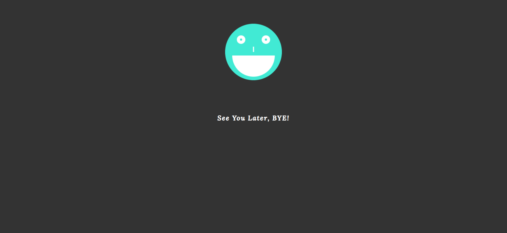

<h1 align="center">📝 To Do List App 📝</h1>

This is a simple to-do list app that allows you to keep track of your tasks and monitor your daily progress on any project or task. It can also help you remember the pending ones.

The To Do List Site/App is live, please [Click Here](https://alakeldev.github.io/to-do-list-pp2/) to check It.

You can check the App/Site on "Am I Responsive!" Website by [Clicking Here](https://ui.dev/amiresponsive?url=https://alakeldev.github.io/to-do-list-pp2/).

## Tabel of Contents
- [Tabel of Contents](#tabel-of-contents)
- [UX](#ux)
  - [Site/App Purpose](#siteapp-purpose)
  - [Site/App Goal](#siteapp-goal)
  - [Audience](#audience)
  - [Communication](#communication)
  - [Current User Goals](#current-user-goals)
  - [New User Goals](#new-user-goals)
- [Design](#design)
  - [Colour Scheme](#colour-scheme)
  - [Typography](#typography)
  - [Imagery](#imagery)
- [Features](#features)
  - [Existing Features](#existing-features)
    - [Start page](#start-page)
  - [Future Features](#future-features)
- [Testing](#testing)
  - [Validator Testing](#validator-testing)
  - [Unfixed Bugs](#unfixed-bugs)
- [Technologies Used](#technologies-used)
  - [Main Languages Used](#main-languages-used)
  - [Frameworks, Libraries \& Programs Used](#frameworks-libraries--programs-used)
- [Deployment](#deployment)
  - [How to deploy](#how-to-deploy)
  - [How to clone](#how-to-clone)
- [Credits](#credits)
  - [Content](#content)
  - [Acknowledgements](#acknowledgements)

## UX

### Site/App Purpose
To provide yourself with a list of your priorities in order to ensure that you don’t forget anything and are able to effectively plan out your tasks so that they are all accomplished in the correct time frame.

### Site/App Goal
To help you organize tasks and stay on top of your deadlines. It replaces pen-and-paper to-do lists and can be used from mobile devices and many desktop devices. It helps you stay productive by organizing everything you need to do in one place.

### Audience
anyone who wants to keep track of their tasks and stay organized. It can be used by students, professionals, and anyone who wants to be more productive and efficient with their time.

### Communication
Through the app/site, with a clear and simple design, you can add tasks and monitor your progress anytime. Even if you close the app, you can get back to your added tasks because of the local storage feature. The website structure is also good and clear.

### Current User Goals
- To help the user stay organized and productive.
- To reduce user stress and anxiety by keeping track of tasks.
- To have a clear picture of what the user need to do.
- To feel more in control of the user workload and less overwhelmed.

### New User Goals
- To learn how to use the app effectively and efficiently.
- To find new ways to stay motivated and focused on their tasks.
- To discover new features and capabilities of the app that can help them be more productive.
- To customize the app to their specific needs and preferences.

## Design

### Colour Scheme
The color palette was created by [Coolors](https://coolors.co) with the idea of providing as much contrast as possible without feeling overwhelming. Most of the colors are primarily dark, simple, and calm across the site. However, the backgrounds (body element color) were generated in one main color (dark color “Jet”). Also, the texts have two main colors (black and white), but the title of the clear all button has a red color. Additionally, I’m using coloring shadows “inset” with Rose and Turquoise colors inside the button and coloring shadows “inset” with black color and anti-flash white as a background for the start app interface. The combination of the background color and shadow color does not overwhelm the user but gives a dark, simple, and stylish feeling. It does not hurt the eyes by working in a dark room.

### Typography
"Lora" was selected for the all App pages as this font has simple, readable and clear decoration. also I make some words looking great by manipulating the space between letters.  ("sans-serif as alt font").

### Imagery
The image showing on the start page (interface) site was sourced from ["pinterest-website-photos sharing."](https://www.pinterest.com/pin/151715081184288287/).

## Features

### Existing Features
#### Start page
We are providing the user with a simple design of a start page app. The start interface/page is simple with a dark background color. It defines the soul of the website/app to make the user’s eyes more comfortable. inside this page, the users have simple design and text, so they can choose between two options, first one is to start the application by clicking on the start button (or even push the Enter button through the keyboard). The other option is by clicking on the close button to close the application if they changed their mind.

### Future Features
- A smart suggestions using machine learning algorithms to suggest tasks based on the user’s previous tasks and habits.
- A voice commands by adding voice commands to your app so that users can add tasks and complete them without having to type.
- An analytics features that allow users to track their productivity and see how much time they spend on different tasks.
- An Email notifications by sending Emails to remind the user about the pending tasks.

## Testing

### Validator Testing
- HTML (By using [W3C validator](https://validator.w3.org/))
  -  Result for index.html (Start Page App)

     
  -  Result for todolistpage.html (To Do List Main Page App)

     
  -  Result for seeyoulater.html (See You Later Page App)

     

- CSS (By using [Jigsaw validator](https://jigsaw.w3.org/css-validator/))
  - Result for style.css

     
  - "The appearing warning is not making negative effect or conflict with the user interactions".

     

- Lighthouse Testing (By using the Lighthouse feature of Google Chrome's Developer Tools)
  - Result for index.html (Start Page App)

     
  - Result for todolistpage.html (To Do List Main Page App)

     
  - Result for seeyoulater.html (See You Later Page App)

     

### Unfixed Bugs

## Technologies Used
### Main Languages Used
- HTML5
- CSS3
- JavaScript

### Frameworks, Libraries & Programs Used
- Google Fonts - for the font families: "Lora" main font. San-serif was used as an alternative font.
- Coolors - to explore different colour schemes that best matched with simple and dark to do list App.
- VS-Code - to creat the html files, CSS styling sheet file and JS files before pushing the project to Github.
- GitHub - to store my repository and deployed live link for submission.
- Balsamiq-wireframes - was used to imagine the basic structure of the app without any styling.
- Am I Responsive? - to ensure the project-App is looked good across all devices.
- favicon.io - to change the png format to favicon format.
- Google Chrome - "Developer Tools, Console, Local Storage" to Monitor my code and check the errors along the way.

## Deployment
### How to deploy
- The site was deployed to GitHub pages. The steps to deploy are as follows:
- In the GitHub repository, navigate to the Settings tab
- From the source section drop-down menu, select the main Branch
- Once the main branch has been selected, the page will be automatically refreshed with a detailed ribbon display to indicate the successful deployment.
- The live link can be found Here [TO-DO-LIST-APP](https://alakeldev.github.io/to-do-list-pp2/)

 ### How to clone
- Go to the following repository on GitHub: https://github.com/alakeldev/to-do-list-pp2
- At the top right of the screen, click the 'Code' button, and then click 'HTTPs'
- Copy the link in this field
- Open VS-code, creat new project folder, open the terminal
- On the terminal type "git clone", then paste the copied url and press 'Enter'
- The clone process should now begin

## Credits

### Content

### Acknowledgements

- I want to say thank you to my mentor Martina, who consistently gave me good advices, feedback and helped me to keep the project within the prospective guidelines.